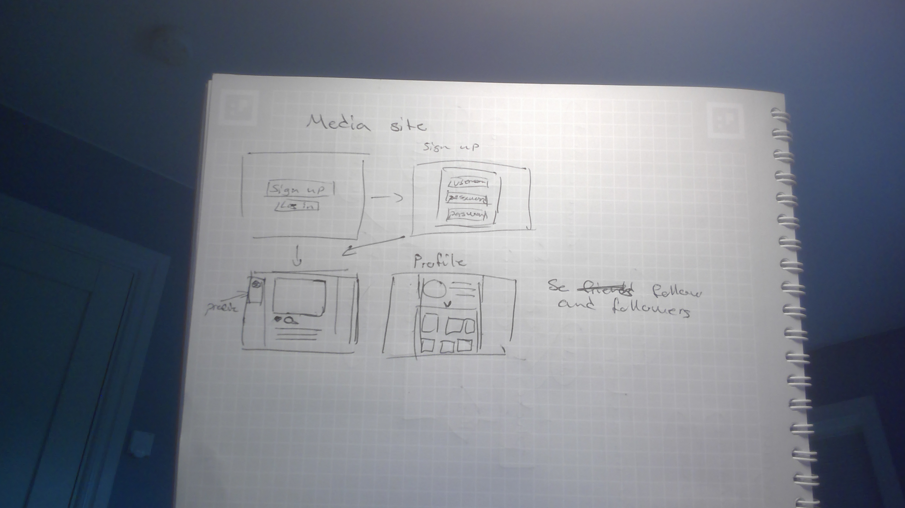
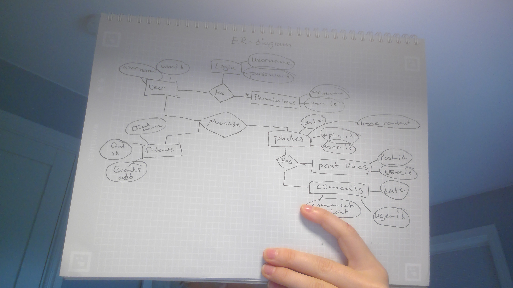

# Projektplan

## 1. Projektbeskrivning (Beskriv vad sidan ska kunna göra).
Som slutproject ska jag skapa mer eller mindre en social media. Man ska kunna göra alla grundläggande grejer som man typiskt kan göra på en social media. Detta innefattar att loga in/registrera och kunna logga ut, lägga up foton och se andras i ett flöde, kunna gilla och komentera på dessa bilder och till sist följa varnadra.

## 2. Vyer (visa bildskisser på dina sidor).

## 3. Databas med ER-diagram (Bild på ER-diagram).

## 4. Arkitektur (Beskriv filer och mappar - vad gör/innehåller de?).

